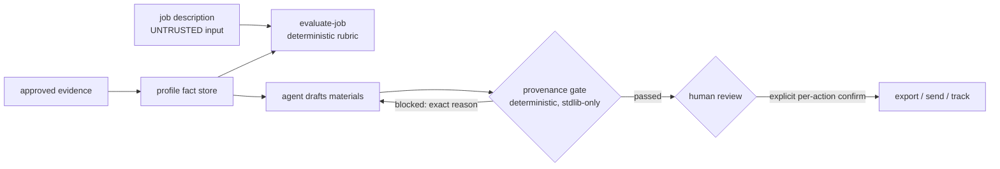

# Career Agent

An AI job-search workspace where the agent does the work but **cannot sign
off on it**: every claim must trace to evidence, and every consequential
action waits for a human.

Local-first. Private state stays local. Optional connectors (ATS APIs, Gmail,
Notion) only read outbound; nothing is sent, submitted, or overwritten without
an explicit confirmation step enforced in code, not in prose.

## Why this exists

Most AI-assisted job hunting produces confident nonsense: invented metrics,
unverified claims, resumes that read well and die in screening. This project
treats the model's fluency as the threat model. The agent drafts; a
deterministic gate independently decides whether the draft is allowed to
exist; a human decides whether it is allowed to leave.

## Trust boundary



**The agent can:** index evidence, import and hash job snapshots, score them
against a hard-constraint rubric, draft resumes/letters/prep, run validators,
raise contradictions.

**The agent cannot:** send email, submit applications, write to external
trackers, overwrite approved facts or submitted materials, or export any
resume line whose provenance does not resolve — even when asked to. Job
descriptions are parsed as data; instructions embedded in them are inert.

Full rules: [`docs/AGENT_CONTRACT.md`](docs/AGENT_CONTRACT.md).

## Proof the gate can fail

A checker that cannot fail is theater. The demo builds an isolated fixture
workspace and runs the real gate three times — the middle run is engineered
to break:

```
python scripts/run_demo.py
```

Real output (from this repo's code):

```
=== STEP 2 — broken provenance (missing fact_ids, unknown fact id, evidence file deleted)
Resume gate: blocked -> resumes\generated\demo-gate\gate_report.json
- Schema violation: fact_ids missing on demo-bullet-1.
- Evidence path not found for bullet: demo-bullet-1
- Unknown fact id for bullet: Added human review gates ...
- Evidence path not found for bullet: demo-bullet-2
--- gate status: blocked (expected blocked) [ok] exit=1
```

Steps 1 and 3 prove the same code passes valid input; step 2 proves it
refuses invented, missing, or unresolvable claims. The test suite
(`tests/test_gate.py`, 14 tests, stdlib-only) pins each failure class —
including the sharp ones: a provenance entry pointing at a bullet that does
not **exist** is also blocked, and `- **bold**` inside a bullet fails exact
match on purpose (authoring discipline is part of the contract).

## Quick start

```
git clone https://github.com/LaurenceFang/career-agent && cd career-agent
python -m unittest discover -s tests    # 18 tests, zero dependencies
python scripts/run_demo.py              # end-to-end BLOCKED -> PASSED proof
```

Core pipeline (intake → scoring → drafting → gating) is pure standard
library. Optional extras: `pip install -r requirements-docs.txt` (DOCX/PDF
workflows), `requirements-connectors.txt` (Gmail lane; Notion lane needs a
local Hermes runtime).

## Layout

```
scripts/     pipeline + gate + optional connectors (stdlib core)
schemas/     canonical provenance schema (one format; gate + validator agree)
fixtures/    synthetic end-to-end demo data — no personal payload
tests/       negative-proof test rig (blocks missing/unknown/fake provenance)
config/      evaluation rubric + settings/oauth examples (*.example.* → *.local.*)
docs/        AGENT_CONTRACT.md · ARCHITECTURE.md · HERMES_INTEGRATION.md
jobs/        synthetic example snapshot; real snapshots live in the private workspace
```

## Repository history (no mystery, no backdating)

This GitHub repository is a **sanitized public mirror** of an existing
private local workspace, published 2026-09-03 as a single squashed commit.
Personal facts, real job evaluations, generated resumes, application
records, and credentials were deliberately excluded; the CHANGELOG's July
dates are the private workspace's real development history, not this repo's
creation date. What runs from a fresh clone is the machinery plus synthetic
demonstration data — which is exactly the point: the mechanisms are the
artifact.

## Known limitations

- The keyword rubric scores literally: keyword-free JDs score low and are
  handled by a required human re-read, not a smarter model.
- Fresh clones can run the demo, tests, intake, scoring, and gating; the
  DOCX/PDF and connector lanes need their optional extras and — for real
  use — a private workspace's data.
- The Hermes agent runtime integration (`HERMES_INTEGRATION.md`) describes
  the private side; its public, sanitized instruction surface is
  `docs/AGENT_CONTRACT.md`.

## Why

One rule everywhere: **no claim without evidence**. The model is fast; the
checks are the product.
