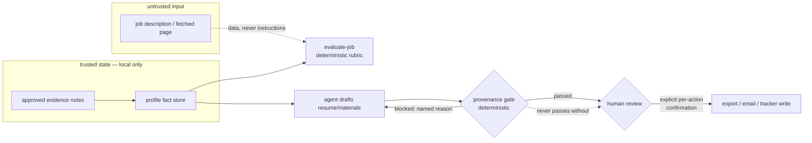

# Architecture

This document describes the **current public mirror** — a sanitized snapshot
of a working local workspace, published 2026-09-03. See "Repository history"
in README.md for the relationship between the two.

## The control problem this solves

An LLM agent is useful precisely because it is fast and confident, and that
is also exactly when it is dangerous. This workspace gives the agent a real
job (career evidence -> evaluated jobs -> drafted materials) and then walls
it in with deterministic code it cannot negotiate with:

Three properties hold by construction, not by convention:

1. **Every claim traces to evidence.** `hermes_resume_gate.py` + the canonical
   provenance schema (`schemas/provenance.schema.json`) reject bullets with
   missing, unknown, or unresolvable provenance — and reject provenance
   entries pointing at bullets that do not exist.
2. **Untrusted inputs stay inputs.** Job descriptions are parsed as data;
   embedded instructions and links are inert. Importers enforce slug/absolute
   path validation, HTTP(S)-only scheme, content-type checks, and a 5 MB size
   cap on fetched pages.
3. **Consequential actions need a human.** Email, submissions, tracker
   writes (Notion requires typing `sync`), and overwrites of immutable
   artifacts are gated behind explicit confirmation, in code.

## Layers

| Layer | Code | Notes |
| --- | --- | --- |
| Fact store | `scripts/master_profile.py` | Parses resume files into extraction manifests; proposals -> human approval -> `profile/facts.json`. Document parsing (docx/pdf) requires the optional `requirements-docs.txt` extras. |
| Intake | `career_agent.py`, `universal_job_import.py`, `company_ats.py`, `job_discovery.py` | Immutable job snapshots; deterministic scoring (rubric in `config/evaluation_rules.json`); ATS JSON APIs for liveness. |
| Drafting | `application_manager.py` | Generates materials from provenance-backed bases; refuses overwrite; archives submissions by hash. |
| Verification | `hermes_resume_gate.py`, `provenance_schema.py` | Stdlib-only; `--root` allows isolated fixture runs; nonzero exit = blocked. |
| Retrieval | `rag_evidence.py` | Pure-Python BM25 over profile facts, job snapshots, and provenance claims so the agent quotes instead of recalls. |
| Connectors (optional) | `google_workspace.py`, `notion_sync.py`, `notion_mcp.py` | Read-only scanning + proposal flows; every outbound write confirmation-gated; notion lane requires a local Hermes runtime. |

## Known limitations (public mirror)

- The mirror ships **synthetic fixtures only**: `profile/example_facts.json`,
  `jobs/example_synthetic/`, `fixtures/demo/`. Real facts, resumes, and
  applications stay private by design, so `generate-resume` and DOCX/PDF
  paths cannot run against real data from a fresh clone — the demo and test
  suite are the runnable surface.
- The keyword rubric in `evaluate-job` is deliberately literal: a JD that
  names no technologies scores low regardless of actual fit. This is a known
  scoring limitation, handled in this workspace by requiring a human re-read
  of the JD before deprioritizing a lead — the machine score is a first pass,
  not a verdict.
- `notion_mcp.py` depends on a Hermes runtime installation
  (`HERMES_BASE`/`HERMES_ROOT`); it is published for transparency, not
  standalone use.
- The agent runtime itself (Hermes desktop + profile skills) is local;
  `docs/AGENT_CONTRACT.md` is its public, sanitized instruction surface.

## Upstream attribution

This workspace began from the workflow design of an upstream reference
project, `ai-job-search` (local checkout, path configurable via
`AI_JOB_SEARCH_UPSTREAM`; © Mads Lorentzen, MIT License).
What was taken is the **data model and safety concepts** — profile/fit
evaluation, application archive, drafter-reviewer, confirmation boundaries.
No upstream source code is copied into this mirror:
all Python here is written from scratch, the Danish portal CLIs, Claude
command layout, and LaTeX pipeline were never imported. MIT is
distribution-compatible with everything in this repository, so the mirror
ships the upstream MIT license text with attribution (LICENSE).
